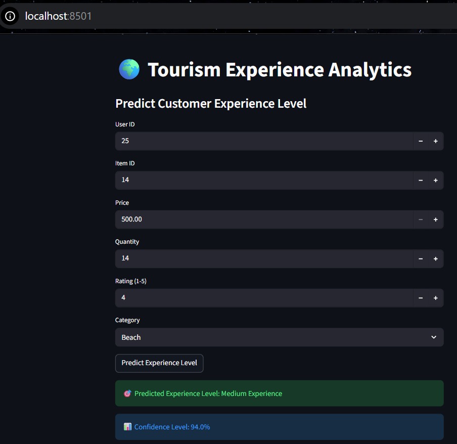

🌍 Tourism Experience Analytics – Streamlit App
👩‍💻 By Sana Kauser V

**Complete End-to-End Machine Learning Project with Deployment using Streamlit**

[](https://www.python.org/downloads/)
[](https://streamlit.io/)
[](LICENSE)

---

## 📌 Project Overview

This project analyzes tourism transaction data and predicts the user experience level using Machine Learning.

It includes:

-📊 Exploratory Data Analysis (EDA)

-🤖 Machine Learning Model Training

-📈 Model Comparison (Logistic Regression vs Random Forest)

-🎯 Feature Importance Analysis

-🌐 Interactive Streamlit Web Application Deployment

The final model predicts whether a tourism experience falls under:

Low Experience

Medium Experience

High Experience

---

## 🚀 Live Features

✔ User Experience Level Prediction

✔ Confidence Score Display

✔ Feature Scaling using StandardScaler

✔ One-Hot Encoding

✔ Random Forest Classification

✔ Interactive UI built with Streamlit

---

## 🛠 Tech Stack

Programming Language

Python 3.11+

Libraries Used

Pandas

NumPy

Scikit-learn

Matplotlib

Seaborn

Streamlit

Pickle

---
## 📁 Project Structure

```
 Tourism-Experience-Analytics-Streamlit-APP/
│
├── Tourism experience analysis.ipynb   # Complete ML pipeline
├── app.py                               # Streamlit web application
├── rf_model.pkl                         # Trained Random Forest model
├── scaler.pkl                           # StandardScaler object
├── requirements.txt                     # Python dependencies
└── README.md
```

---

## 📊 Dataset Description

The dataset contains simulated tourism transaction data including:

-user_id

-item_id

-price

-quantity

-rating

-category

Categories include:

-Beach

-Adventure

-Heritage

-Wildlife

-Luxury

---

## ⚙️ Machine Learning Workflow

1.Data Generation & Cleaning

2.Exploratory Data Analysis

3.Feature Engineering

4.One-Hot Encoding of Category

5.Feature Scaling using StandardScaler

6.Train-Test Split

7.Model Training

-Logistic Regression

-Random Forest Classifier

8.Model Evaluation

9.Feature Importance Extraction

10.Model Deployment using Streamlit

---

## 📈 Model Performance
Logistic Regression

-Used as baseline model

Random Forest Classifier

-Better accuracy than Logistic Regression

-Used for final deployment

-Provides feature importance ranking

---
## ▶️ How To Run This Project
 # 1️⃣ Clone Repository

```bash
# clone repository 
git clone https://github.com/SanaXD25/Tourism-Experience-Analytics-Streamlit-APP.git
cd Tourism-Experience-Analytics-Streamlit-APP

# Install Dependencies
pip install -r requirements.txt

## 3️⃣ Run Jupyter Notebook (Optional – For Training)
jupyter notebook

# 4️⃣ Launch Streamlit App
streamlit run app.py

The app will open in your browser at:
http://localhost:8501
```
---

## 🧠 How Prediction Works

The user inputs:

-User ID

-Item ID

-Price

-Quantity

-Rating

-Category

The app:

-Applies One-Hot Encoding

-Aligns features with training data

-Scales input using StandardScaler

-Predicts Experience Level using Random Forest

-Displays prediction with confidence score

---

## 📸 Sample Output

Predicted Experience Level


Confidence Percentage

Clean interactive UI

---

## 🎯 Learning Outcomes

Through this project, I strengthened my understanding of:

-Feature Engineering

-Classification Models

-Data Preprocessing

-Model Evaluation Metrics

-Model Serialization using Pickle

-Deployment using Streamlit

---

## 👩‍💻 Author

Sana Kauser V

GitHub: https://github.com/SanaXD25

LinkedIn: https://www.linkedin.com/in/skxd25


---

## 📜 License

This project is created for educational and portfolio purposes.

---
### 🚀 End-to-End ML Project | Data Science | Deployment Ready
